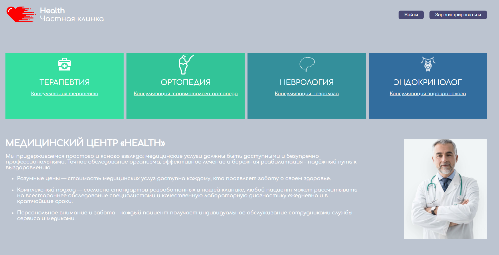
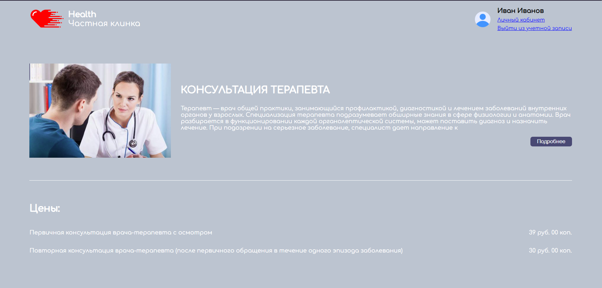
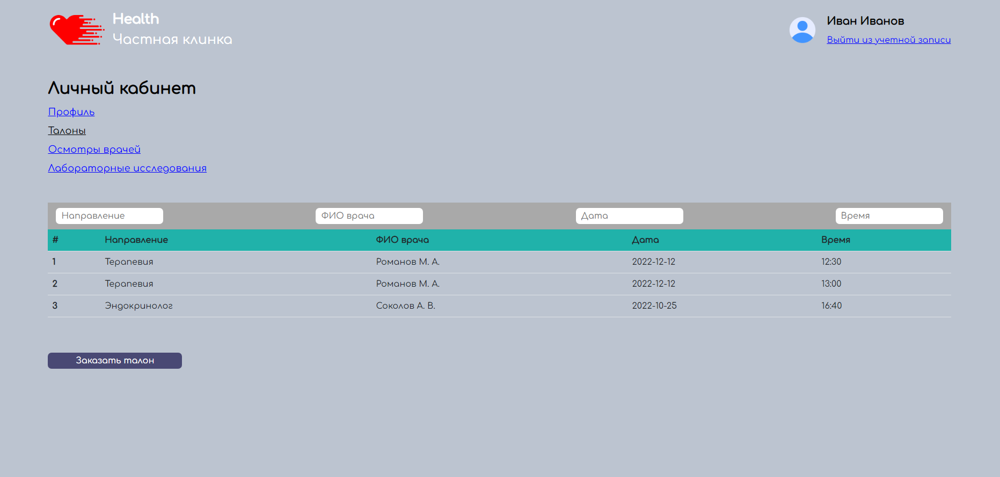

      

    
        
    

## About

Веб-приложение для частной клиники может стать неотъемлемым инструментом как для пациентов, так и для медицинских работников. Частные клиники предоставляют широкий спектр услуг, от общих проверок до специализированных лечений, и веб-приложение может облегчить доступ пациентов к этим услугам и помочь медицинским работникам эффективно управлять своей нагрузкой.

Для пациентов веб-приложение может позволить им заказывать приемы и просматривать свои медицинские записи. Также приложение может предоставлять информацию о услугах, предлагаемых клиникой, квалификации медицинских работников и другую важную информацию.

Для медицинских работников веб-приложение может помочь им управлять своей нагрузкой путем легкого заказа приемов. 

## Screenshots

<table>
    <tr>
            
    </tr>
      <tr>
            
    </tr>
      <tr>
            
    </tr>
</table>

## Release 

http://health-private.hopto.org/

## Developers

- [LastHope](https://github.com/LastHope0)
- [1Lena1](https://github.com/1Lena1)
- [Yu1oP](https://github.com/postavtezachet)

## License

Project Health is distributed under the MIT license.
