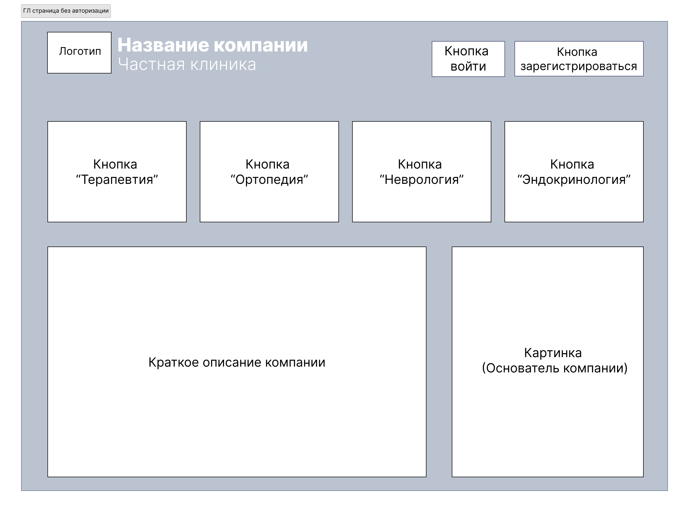
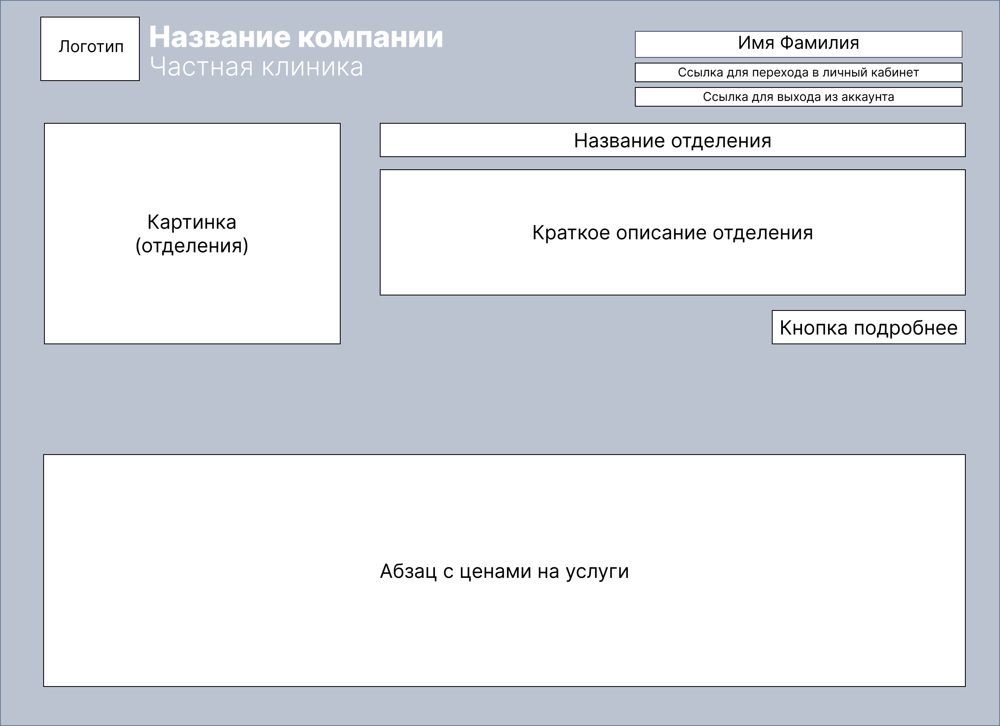
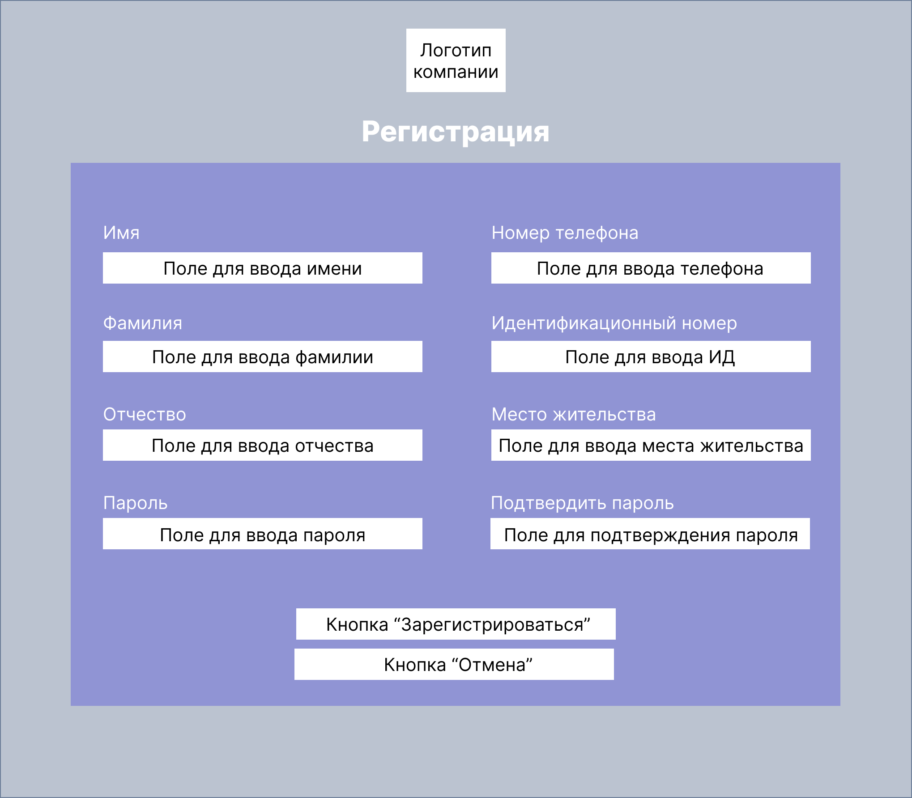
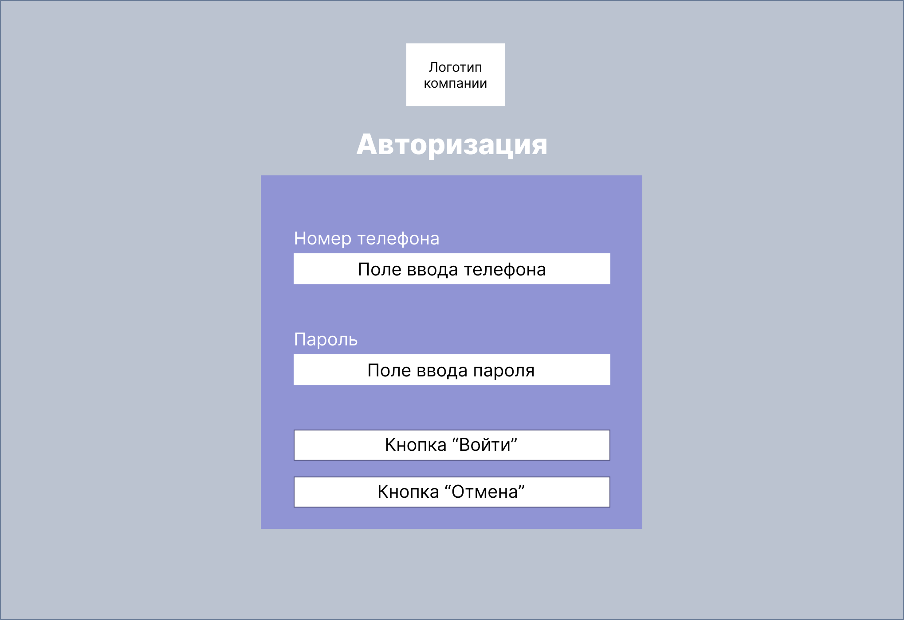
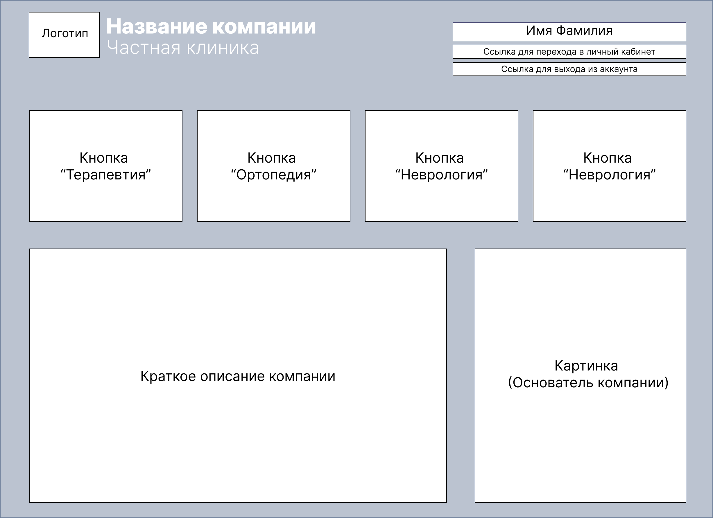
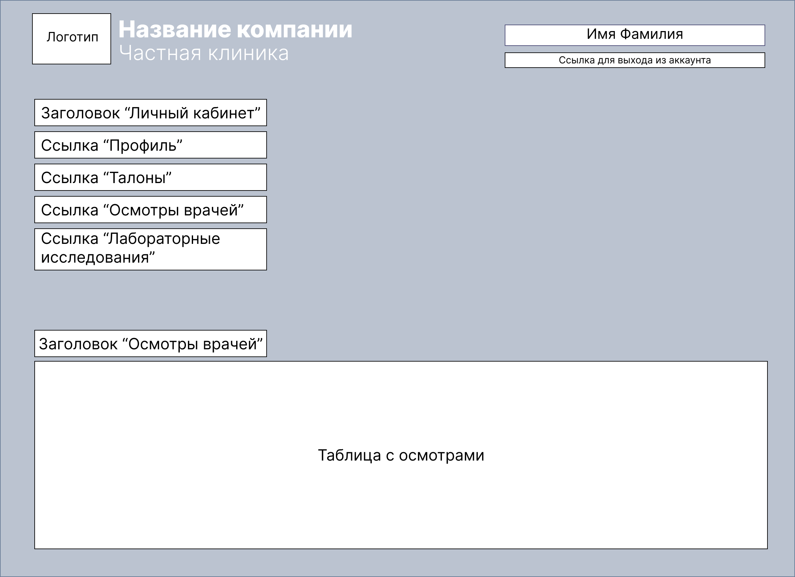
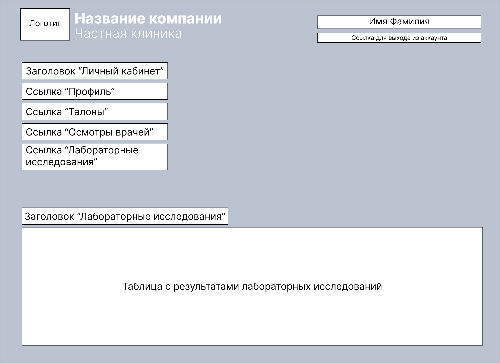

# Требования к проекту
---

# Содержание
1 [Введение](#intro)  
1.1 [Назначение](#appointment)  
1.2 [Бизнес-требования](#business_requirements)  
1.2.1 [Исходные данные](#initial_data)  
1.2.2 [Возможности бизнеса](#business_opportunities)  
1.2.3 [Границы проекта](#project_boundary)  
2 [Требования пользователя](#user_requirements)  
2.1 [Интерфейс пользователя](#user_interface)  
2.2 [Характеристики пользователей](#user_specifications)  
2.3.1 [Классы пользователей](#user_classes)  
2.3.2 [Аудитория приложения](#application_audience)  
2.4 [Предположения и зависимости](#assumptions_and_dependencies)  
3 [Системные требования](#system_requirements)  
3.1 [Функциональные требования](#functional_requirements)  
3.1.1 [Основные функции](#main_functions)  
3.1.1.1 [Главная страница](#main_page)  
3.1.1.2 [Личный кабинет](#personal_page)

3.2 [Нефункциональные требования](#non-functional_requirements)  
3.2.1 [Атрибуты качества](#quality_attributes)  
3.2.2 [Внешние интерфейсы](#external_interfaces)  
3.2.3 [Ограничения](#restrictions)  

<a name="intro"/>

# 1 Введение
Название проекта: "Health"

Приложение предназначенно для частной клиники, представляющей различные медицинские услуги.

<a name="appointment"/>

## 1.1 Назначение
В этом документе описаны функциональные и нефункциональные требования к приложению «Health». Этот документ предназначен для команды, которая будет реализовывать и проверять корректность работы приложения. 

<a name="business_requirements"/>

## 1.2 Бизнес-требования

<a name="initial_data"/>

### 1.2.1 Исходные данные
Большинство людей предпочитают электронную информацию, бумажной. Запись к врачу в большинстве случаев осуществляются через интернет, чем звонки и очереди в регистратуру.    

<a name="business_opportunities"/>

### 1.2.2 Возможности бизнеса
Многие люди желают иметь приложение, которое позволит записаться к врачу и получить результат их визита в клинику, не выходя из дома. Подобное приложение позволит им тратить меньше времени, нет необходимости личного присутствия и ожидания в очередях. 

<a name="project_boundary"/>

### 1.2.3 Границы проекта
Приложение «Health» позволит зарегистрированным пользователям просматривать информацию об их визитах в клинику. Для анонимных пользователей предусмотрена возможность просмотра информации о самой клинике, врачах и предоставляемых услугах.

<a name="user_requirements"/>

# 2 Требования пользователя

<a name="user_interface"/>

## 2.1 Интерфейс пользователя

## Главная страница приложения.
 После перехода по ссылке, пользователь попадает на главную страницу веб-приложения: 
  
Здесь располагаеся краткая информация о клинике и меню для дальнейшего передвижения по сайту. Четыре кнопки с различными медицинскими направлениями (терапевтия, ортопедия, неврология, эндокринология) позволят пользователю получить более подробную информацию об оказываемых услугах. 

## Информация об услугах.  
 При нажатии на одну из кнопок с медицинским направлением (терапевтия, ортопедия, неврология, эндокринология), он попадает на следующую страницу:
  
 Здусь можно узнать подробности об выбранном направлении и услугах, оказываемых данным специалитом. Также здесь можно узнать стоимость оказываемых услуг. Для возврата на главную страницу нужно нажать на логотип компании.
 
## Окно регистрации.  
Если пользователь зашел на сайт впервые и хочет получить доступ к услугам, ему необходимо зарегистрироваться. Для этого на главной странице нужно нажать кнопку _"Регистрация"_. После чего он попадает на следующую страницу:
  

## Окно входа.  
Если у пользователя уже есть аккаунт, то для получения доступа к полному функционалу приложения, ему небходимо авторизироваться. Для этого на главной странице нужно нажать кнопку _"Войти"_. После чего он попадает на следующую страницу:
  

## Главная страница авторизированного пользователя.
После авторизации пользователь попадает на главную страницу: 

Но теперь справа вверху пишется его имя и фамилия, а также находится ссылка, чтобы выйти из аккаунта или чтобы попасть в личный кабинет.

## Личный кабинет вкладка "Профиль".   
После нажатия ссылки _"Личный кабинет"_, пользователь попадает в личный кабинет:
  
Здесь можно изменить данные профиля или перейти к следующим функциям, нажав на соответствующие ссылки.

## Личный кабинет вкладка "Осмотры врачей".  
После нажатия ссылки _"Осмотры врачей"_, пользователь попадвет на следующую страницу:
  
Здесь находится информация о посещении пациентом врачей. Каждый осмотр является строкой таблицы (все осмотры сортируются по дате, самые новые сверху), а также ссылкой на полную версию.

## Личный кабинет вкладка "Лабораторные иследования".  
После нажатия ссылки _"Лабораторные исследования"_, пользователь попадает на следующую страницу:
  
Здесь находятся результаты всех лабораторных исследований.

## Личный кабинет вкладка "Талоны".  
После нажатия ссылки _"Талоны"_, пользователь попадает на следующую страницу:
  
Здесь можно посмотреть активные талоны. Также, если нажать кнопку _"Заказать талон"_, можно записаться к врачу.

## Окно "Заказать талон".  

  

<a name="user_specifications"/>

## 2.2 Характеристики пользователей

<a name="user_classes"/>

### 2.3.1 Классы пользователей

| Класс пользователей | Описание |
|:---|:---|
| Анонимные пользователи | Пользователи, которые не хотят регистрироваться в приложении. Имеют доступ к частичному функционалу (только просмотр информации о клинике)|
| Зарегистрированные пользователи | Пользователи, которые вошли в приложение под своим именем. Имеют доступ к полному функционалу |

<a name="application_audience"/>

### 2.3.2 Аудитория приложения

Люди возрастной группы 18+ с любым уровнем образования. 

<a name="collateral_audience"/>

## 2.4 Предположения и зависимости
1. Приложение не работает при отсутствии подключения к Интернету;
2. Для работы приложения необходим любой из современных браузеров таких, как Opera, Chrome, Firefox и их аналоги.
3. Приложение работает только на ПК.
<a name="system_requirements"/>

# 3 Системные требования

<a name="functional_requirements"/>

## 3.1 Функциональные требования

<a name="main_functions"/>

### 3.1.1 Основные функции

<a name="main_page"/>

#### 3.1.1.1 Главная страница
**Описание.** На главной странице соддержится информация о клинике и предоставляемых услугах, меню входа и регистрации.
| Функция | Требования | 
|:---|:---|
| Просмотр информации | Приложение должно предоставить пользователю возможность посмотреть информацию о клинике и о предоставляемых услугах |
| <a name="registration_requirements"/>Регистрация нового пользователя | Приложение должно запросить у пользователя ввести данные (ФИО, номер телефона, идентификационный номер, место жительства) для создания учётной записи. Пользователь должен либо ввести данные, либо отменить действие |
| Вход зарегистрированного пользователя в приложение | Приложение должно запросить номер телефона и пароль для входа в учетную запись. Пользователь должен либо ввести свои данные, указанные при регистрации, либо отменить действие |

<a name="personal_page"/>

#### 3.1.1.2 Личный кабинет
**Описание.** Зарегистрированный пользователь имеет возможность войти в личный кабинет и получить доступ к расширенному функционалу.
 
| Функция | Требования | 
|:---|:---|
| Редактирование профиля | Должна быть возможность редактирования профиля |
| Информация о посещении клиники | Зарегистрированный пользователь имеет возможность посмотреть информацию о его посещениях клиники такую, как осмотр врача и результаты лабораторных иследований |
| Получение талона | Приложение должно предоставить зарегистрированному пользователю меню для выбора даты, специалиста и информацию о свободных талонах |

<a name="non-functional_requirements"/>

## 3.2 Нефункциональные требования

<a name="quality_attributes"/>

### 3.2.1 Атрибуты качества

1. Все функциональные элементы пользовательского интерфейса имеют названия, описывающие действие, которое произойдет при выборе элемента;
2. Интуитивно понятный интерфейс.

<a name="external_interfaces"/>

### 3.2.2 Внешние интерфейсы
Окна приложения удобны для использования пользователями с плохим зрением:
  * размер шрифта не менее 14пт;
  * функциональные элементы контрастны фону окна;
  * приложение не должно быть громоздким и вводить пользователя в заблуждение, из-за наличия слишком большого количества функций;
  * приложение должно быть в пастельных цветах, соответсвущих медицинской сфере (синий, зеленый, белый и другие).
  
<a name="restrictions"/>

### 3.2.3 Ограничения
1. Приложение реализовано с использованием следующих языков HTML5, CSS3, JS  and PHP 8;
2. Для хранения данных пользователя используется phpMyAdmin.
3. Запросы в БД осуществляются с помощью MySQL.