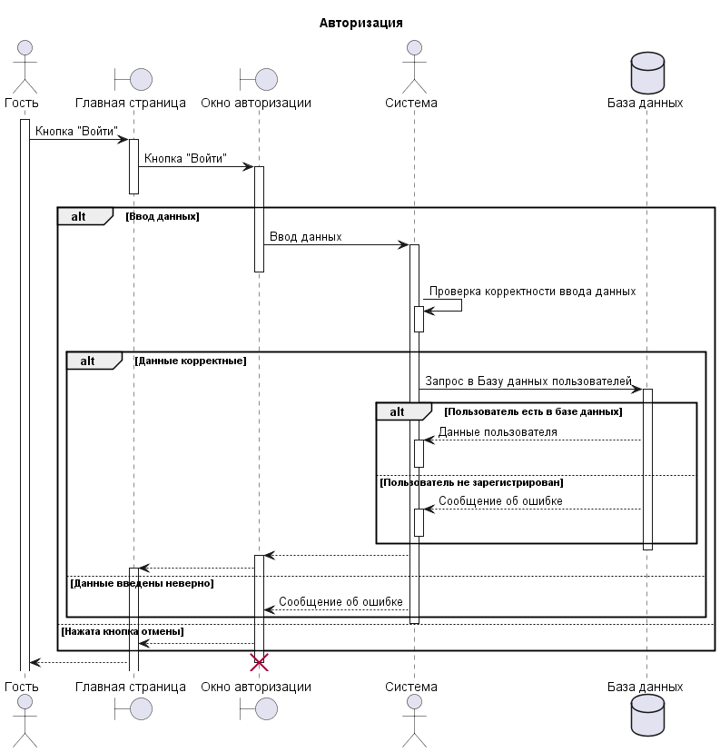
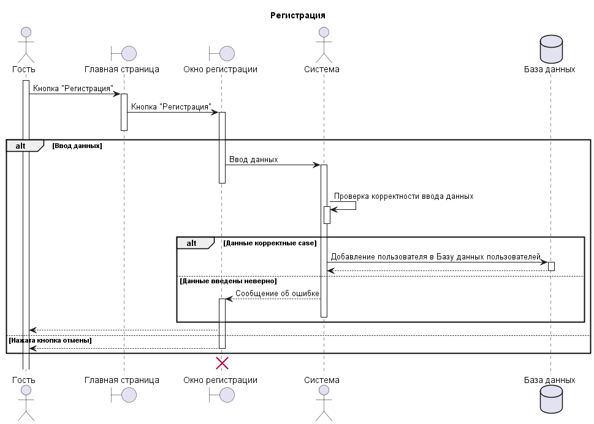
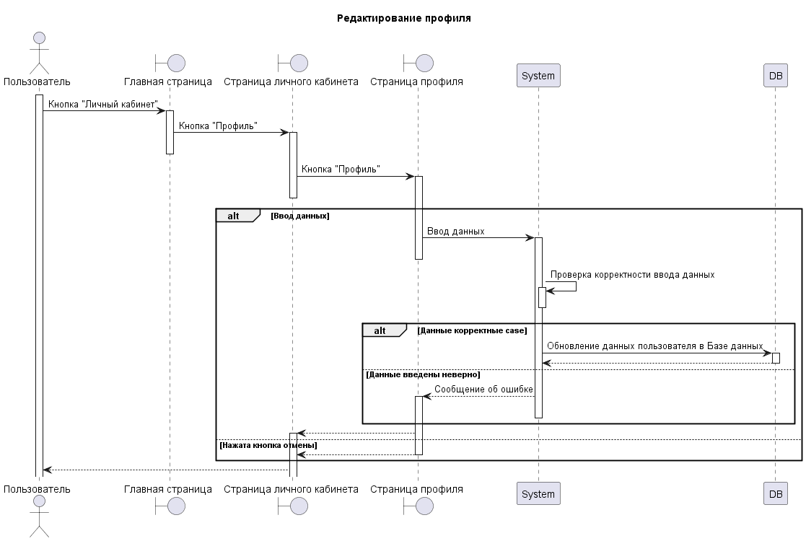
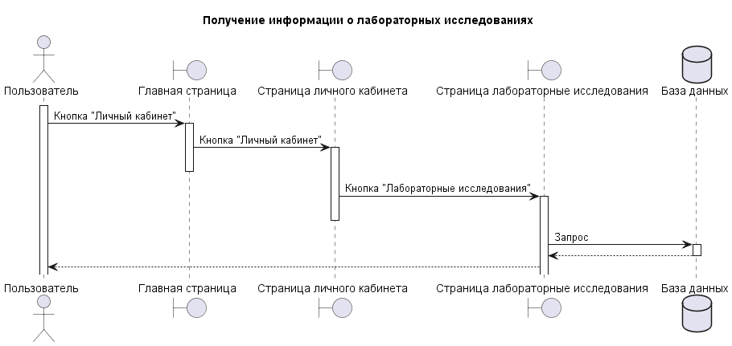
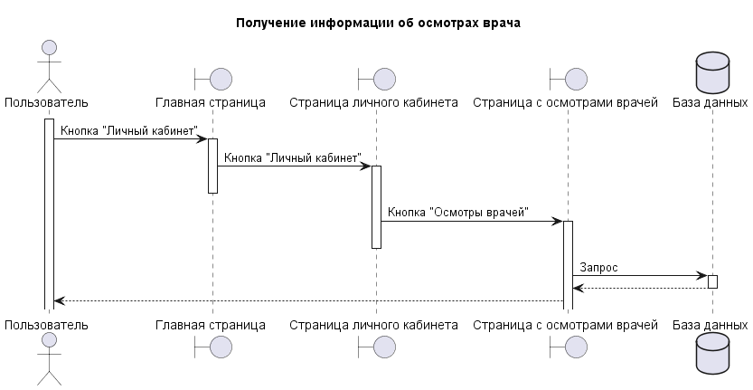

# Диаграммы последовательностей
---

# Содержание
1 [Авторизация](#1)  
2 [Регистрация](#2)  
3 [Редактирование профиля](#3)
4 [Получение информации о лабораторных исследованиях](#4)
5 [Получение информации об осмотрах врачей](#5)

<a name="1"/>

# 1 Авторизация

<a name="2"/>

# 2 Регистрация

<a name="3"/>

# 3 Редактирование профиля

<a name="4"/>

# 4 Получение информации о лабораторных исследованиях

<a name="5"/>

# 5 Получение информации об осмотрах врачей

    
    
    
