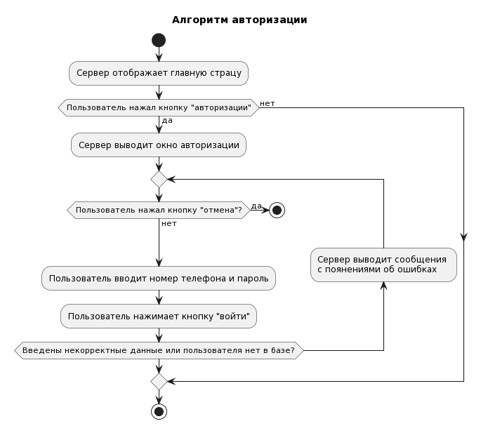

# Диаграммы активности

# Содержание
1. [Авторизация](#1)  
2. [Регистрация](#2)  
3. [Бронирование талона](#3)
4. [Получение информации о лабораторных исследованиях](#4)
5. [Получение информации об осмотрах врачей](#5)
6. [Редактирование профиля](#6)

<a name="1"/>
# 1. Авторизация

<a name="2"/>
# 2. Регистрация

<a name="3"/>
# 3. Бронирование талона

<a name="4"/>
# 4 Получениеи информации о лаборатотрных исследованиях

<a name="5"/>
# 5 Получение информации об осмотрах врачей

<a name="6"/>
# 6 Редактирование профиля

