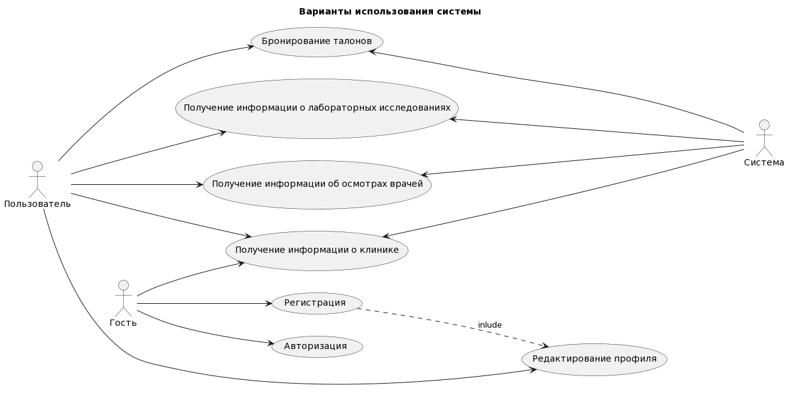

# Поток событий
---

# Содержание
1 [Актёры](#actors)  
2 [Варианты использования](#use_case)  
2.1 [Авторизация](#Authorization)  
2.2 [Регистрация](#Registration)  
2.3 [Получение информации о клинике](#info_clinic)  
2.4 [Редактирование информации профиля](#profile_edit)  
2.5 [Получение информации об осмотрах врачей](#info_doctors)  
2.6 [Получение информации о лабораторных исследованиях](#info_analizis)  
2.7 [Бронирование талонов](#tickets)  

<a name="actors"/>
# 1 Актёры

| Актер | Описание |
|:---|:---|
| Гость | Человек, не прошедший авторизацию |
| Пользователь | Человек, прошедший авторизацию |
| Система | Приложение "Health" |

<a name="#use_case"/>
# 2 Варианты использования

Use Case диаграмма приложения "Health":

<a name="Registration"/>
## 2.1 Регистрация
| Действующие лица | Гость, Система |
|:--|:--|
| Цель | Пользователь: зарегистрироваться в системе и начать работать; Система: добавить пользователя в базу данных |
| Успешный сценарий:| 1. Пользователь запускает систему и нажимает кнопку зарегистрироваться. Система предлагает ввести ФИО, номер телефона, идентификационный номер, обслуживающую поликлинику, адрес проживания, пароль | 
| | 2. Пользователь вводит ФИО, номер телефона, идентификационный номер, обслуживающую поликлинику, адрес проживания, пароль. | 
| | 3. Система проверяет данные введенные пользователем. |
| | 4. Система добавляет данные пользователя в базу данных |
| | 5. Система выдает пользователю сообщение по поводу успешной регистрации. |
| Результат | Пользователь успешно зарегистрирован и может работать с системой. |
| Расширения: ||
| \*а |	Нет доступа к БД. Система выдает сообщение (ссылка на сообщение). Результат: пользователь не может зарегистрироваться.|
| 3a | Пользователь с ввел некорректные данные. Результат: отказ в регистрации. Система выдает сообщение (ссылка на сообщение). Переход на шаг 2 |

<a name="Authorization"/>
## 2.2 Авторизация
| Действующие лица | Гость, Система |
|:--|:--|
| Цель | Пользователь: авторизоваться в системе и начать работать;Система: идентифицировать пользователя и его права |
| Предусловия | Пользователь |
| Успешный сценарий:| 1. Пользователь запускает систему и нажимает кнопку войти. Система предлагает ввести логин и пароль. | 
| | 2. Пользователь вводит логин и пароль. | 
| | 3. Система проверяет логин и пароль. |
| | 4. Система добавляет данные пользователя в базу данных |
| | 5. Система выдает пользователю сообщение по поводу успешной авторизации. |
| Результат | Пользователь успешно авторизирован и может работать с системой. |
| Расширения: ||
| \*а |	Нет доступа к БД.Система выдает сообщение (ссылка на сообщение). Результат: пользователь не может войти.|
| 3a | Пользователь с введенными логином и паролем не найден.Результат: отказ в авторизации. Система выдает сообщение (ссылка на сообщение). Переход на шаг 2 |

<a name="info_clinic"/>
## 2.3 Просмотр информации о клинике
| Действующие лица | Гость, Система |
|:--|:--|
| Цель | Пользователь: получить информацию о клинике |
| Успешный сценарий:| 1. Пользователь запускает систему. Система выводит главную страницу | 
| | 2. Пользователь переходит по пунктам меню, для просмотра подробной информации о интересуещем его направлении | 
| Результат | Пользователь получил нужные сведения |

<a name="profile_edit"/>
## 2.4 Редактирование информации профиля
| Действующие лица | Пользователь, Система |
|:--|:--|
| Цель | Пользователь: изменить данные профиля; Система: обновить данные пользователя в базе данных |
| Успешный сценарий:| 1. Пользователь нажимает кнопку "личный кабнет". Система выводит страничку с личным кабинетом |
| | 2. Пользователь нажимет кнопку "редактирование профиля". Система выводит страничку с редактированием пользователя и предлагает ввести новые параметры (ФИО, номер телефона, идентификационный номер, обслуживающую поликлинику, адрес проживания, пароль) | 
| | 3. Пользователь вводит ФИО, номер телефона, идентификационный номер, обслуживающую поликлинику, адрес проживания, пароль. | 
| | 4. Система проверяет данные введенные пользователем. |
| | 5. Система изменяет данные пользователя в базу данных |
| | 6. Система выдает пользователю сообщение по поводу успешном изменении профиля. |
| Результат | Обновленные данные о пользователе в базе данных |
| Расширения: ||
| \*а |	Нет доступа к БД. Система выдает сообщение (ссылка на сообщение). Результат: пользователь не может зарегистрироваться.|
| 3a | Пользователь с ввел некорректные данные. Результат: отказ в изменении данных. Система выдает сообщение (ссылка на сообщение). Переход на шаг 2 |

<a name="info_doctors"/>
## 2.5 Просмотр данных о посещении врачей
| Действующие лица | Пользователь, Система |
|:--|:--|
| Цель | Пользователь: получить данные об осмотрах врачей |
| Успешный сценарий:| 1. Пользователь нажимает кнопку "личный кабнет". Система выводит страничку с личным кабинетом |
| | 2. Пользователь нажимет кнопку "осмотры врачей". Система выводит информацию о посещении врачей, представленную в виде таблицы | 
| | 3. Пользователь выбирает строку таблицы | 
| | 4. Система выдает новую страничку с подробной информацией |
| Результат | Пользователь получил сведения об осмотре врача |
| Расширения: ||
| \*а |	Нет доступа к БД. Система выдает сообщение (ссылка на сообщение). Результат: пользователь не может зарегистрироваться.|

<a name="info_analizis"/>
## 2.6 Просмотр данных о лаборных исследованиях
| Действующие лица | Пользователь, Система |
|:--|:--|
| Цель | Пользователь: получить данные о лаборных исследованиях |
| Успешный сценарий:| 1. Пользователь нажимает кнопку "личный кабнет". Система выводит страничку с личным кабинетом |
| | 2. Пользователь нажимет кнопку "лабораторные исследования". Система выводит информацию о лабораторных исследованиях, представленную в виде таблицы | 
| | 3. Пользователь выбирает строку таблицы | 
| | 4. Система выдает новую страничку с подробной информацией |
| Результат | Пользователь получил сведения об осмотре врача |
| Расширения: ||
| \*а |	Нет доступа к БД. Система выдает сообщение (ссылка на сообщение). Результат: пользователь не может зарегистрироваться.|

<a name="tickets"/>
## 2.7 Бронирование талонов
| Действующие лица | Пользователь, Система |
|:--|:--|
| Цель | Пользователь: забронировать талон. Система: предоставить данные о свободных талонах |
| Успешный сценарий:| 1. Пользователь нажимает кнопку "личный кабнет". Система выводит страничку с личным кабинетом |
| | 2. Пользователь нажимет кнопку "Талоны". Система выводит информацию о действующих талонах, представленную в виде таблицы | 
| | 3. Пользователь нажимает кнопку "Заказать талон" | 
| | 4. Система выдает новую страничку с таблицей доступных талонов |
| | 5. Пользователь нажимает кнопку "Заказать" рядом с интересующим талоном | 
| | 6. Система обновляет таблицу с действующими талонами и помечает в базе данных талон как забронированный |
| Результат | Талон забронирован пользователем и добавлен в личный кабинет пользователя |
| Расширения: ||
| \*а |	Нет доступа к БД. Система выдает сообщение (ссылка на сообщение). Результат: пользователь не может зарегистрироваться.|
