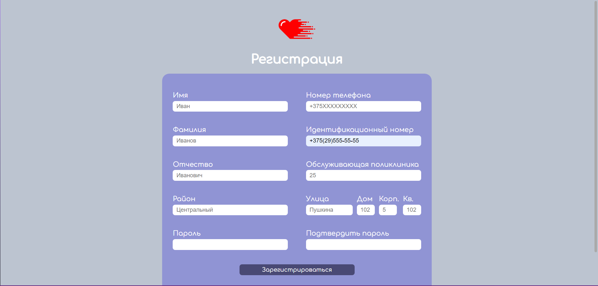

# Содержание
1 [Введение](#intro)    
2 [Объект тестирования](#testing_object)                                                                                                                               
3 [Атрибуты качества](#quality_attributes)  
4 [Риски](#risks)  
5 [Аспекты тестирования](#testing_aspects)                                                                                                           
6 [Подходы к тестированию и их реализация](#testing_approaches)                                                                                    
7 [Представление результатов](#results)                                                                                         
8 [Выводы](#conclusion)                                                                                                                    

<a name="intro"/>

# 1 Введение

Данный план предназначен для тестирования вэб-приложения "Health". Цель проведения тестирования - проверка работоспособности и пригодности приложения для практического использования ручным способом, а также автоматическое тестирование отдельных компонентов пользовательского интерфейса и их совместного использования.

<a name="testing_object"/>

# 2 Объект тестирования

В качестве объектов тестирования можно выделить атрибуты качества платформы по ISO 25010:

1. функциональность

  - функциональная полнота: приложение должно выполнять все заявленные функции
  - функциональная корректность: приложение должно выполнять все заявленные функции корректно

2. удобство использования

  - удобство пользовательского интерфейса: элементы управления объектами должны быть простыми и интуитивно понятными пользователю
  - уведомление пользователя о неправильных действиях: приложение должно сообщать пользователю об ошибках и о неправильном использовании

<a name="quality_attributes"/>

# 3 Атрибуты качества

1. Функциональность:

    - функциональная полнота: приложение должно соответствовать всем функциональным требованиям, заявленных в [SRS](https://github.com/PolliMur/tritpo-lab2/blob/master/SRS/README.md);
    
2. Удобство использования:

    - простота пользовательского интерфейса: интерфейс должен быть достаточно простым для интуитивного использования новым пользователем
    
3. Кроссплатформенность:

    - корректная работа приложения на платформах:
      - Windows
      - Linux
      - MacOS
      
    Корректная работа приложения гарантирована на любой платформе в рамках браузеров из следующего списка: Google Chrome версии 96.0 и выше, Mozilla Firefox версии 98.0 и выше, Opera версии 70.0 и выше, Microsoft Edge версии 100 и выше.
      
4. Адаптивность

    - возможность комфортного использования приложения на ПК и ноутбуке.
    
    
<a name="risks"/>

# 4 Риски

Приложение не использует функций и особенностей конкретных браузеров, возможно использование во всех браузерах, указанных в SRS, начиная с указанных версий.

<a name="testing_aspects"/>

# 5 Аспекты тестирования

Тестирование приложения осуществляется двумя способами:

1. Автоматизированное тестирование
2. Ручное тестирование

Для автоматического тестирования используются unit-tests PHPUnit.

<a name="testing_approaches"/>

# 6 Подходы к тестированию и их реализация

## Проведём тестировани работы приложения и выполнения различных операций ручным способом при запуске приложения локально:

При запуске приложения попадаем на главную страницу приложения. 

На главной странице мы видим кнопку регистрации, нажимаем ее и пробуем заполнить формы.

Если данные будет введены неверно, т.е. не будут соответствовать схеме, указанной в SRS, то под полями ввода должны появиться собщения об ошибке ввода.

Вводим данные верно и нажимаем на кнопку регистрации, выводится сообщение об успешной регистрации

Попадаем в окно авторизации, пробуем заполнить формы.

Если данные будет введены неверно, т.е. не будут соответствовать схеме, указанной в SRS, то под полями ввода должны появиться собщения об ошибке ввода.

При верном вводе данных нажимаем кнопку войти и попадаем на главную страницу. В правом верхнем углк появится имя и фамилия, что свидетельствует об успешной авторизации.

## Рассмотрим автоматизированное тестирование компонентов приложения:

Как среда для запуска тестов был использован PHP v8.13 фреймворк для тестирования PHPUnit.

<a name="results"/>

# 7 Представление результатов

<a name="conclusion"/>

# 8 Выводы

Данный тестовый план позволяет протестировать основной функционал приложения. Успешное прохождение всех тестов не гарантирует полной работоспособности на всех платформах и архитектурах, однако позволяет полагать, что данное программное обеспечение работает корректно.
